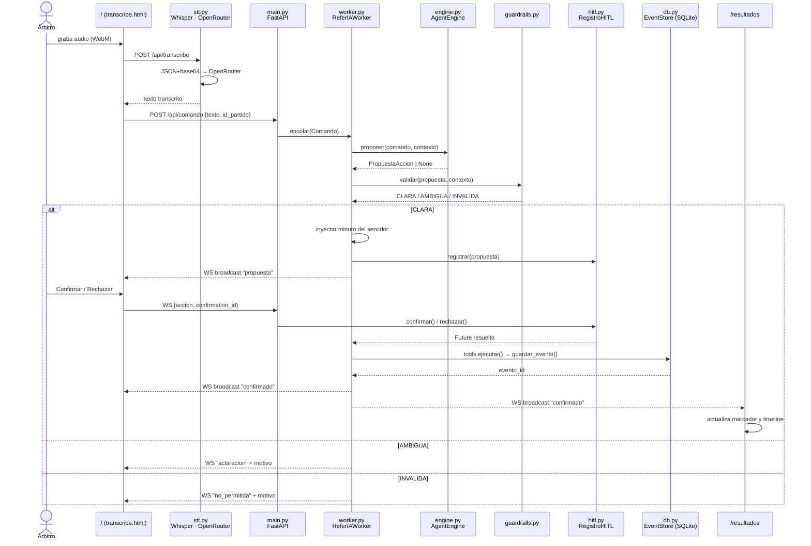
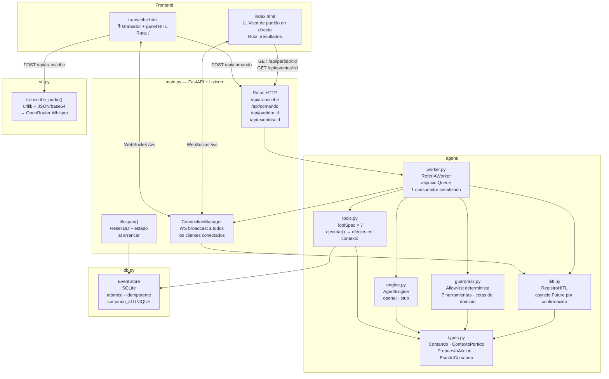
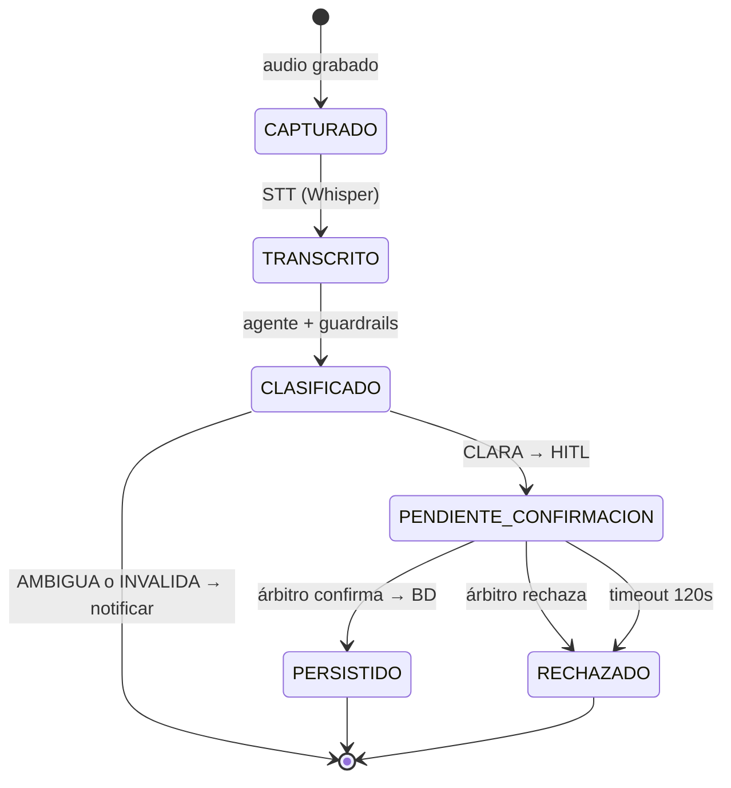

# ReferIA


Asistente de árbitro de fútbol con voz. Graba audio desde el navegador, lo transcribe con Whisper (vía OpenRouter), y un agente LLM traduce el comando a acciones de partido (goles, faltas, cambios…) con confirmación humana antes de escribir en la BD. Ejercicio parte del curso de Construcción de Agentes Autónomos con IA.

---

## Cómo funciona

### Flujo de un comando de voz



### Módulos del proyecto



### Ciclo de vida de un comando



---

## Requisitos

- Python ≥ 3.13
- [uv](https://docs.astral.sh/uv/)
- Clave de [OpenRouter](https://openrouter.ai/) (`OPENROUTER_API_KEY`)

## Instalación y arranque

```bash
cp .env.example .env    # editar OPENROUTER_API_KEY y REFERIA_ENGINE
uv sync
uv run python main.py
```

Abrir `http://127.0.0.1:8000`.

## Variables de entorno

| Variable | Default | Descripción |
|---|---|---|
| `OPENROUTER_API_KEY` | — | **Obligatoria**. Clave de OpenRouter |
| `OPENROUTER_BASE_URL` | `https://openrouter.ai/api/v1` | Base URL de la API |
| `REFERIA_STT_MODEL` | `openai/whisper-large-v3-turbo` | Modelo STT |
| `REFERIA_ENGINE` | `stub` | Motor del agente: `openai` o `stub` |
| `REFERIA_OPENAI_MODEL` | `gpt-4o-mini` | Modelo LLM (cuando `REFERIA_ENGINE=openai`) |
| `REFERIA_DB_PATH` | `referia.db` | Ruta al fichero SQLite |

> **Nota:** La BD se limpia al arrancar la app (`EventStore.limpiar_todo()`). Útil para pruebas; deshabilitar en producción.

## Uso

1. Abre `/` — interfaz del árbitro con grabador y panel HITL.
2. Di **"inicio del partido"** para arrancar el reloj.
3. Pulsa **Enviar comando** y habla (gol, falta, cambio…).
4. Confirma o rechaza la propuesta que aparece en pantalla.
5. El evento aparece en tiempo real en `/resultados`.

## API

| Método | Ruta | Descripción |
|---|---|---|
| GET | `/` | Interfaz del árbitro (grabador + HITL) |
| GET | `/resultados` | Visor de partido en directo |
| GET | `/health` | Health check |
| POST | `/api/transcribe` | Transcribe audio (multipart `file`) |
| POST | `/api/comando` | Encola `{"texto", "id_partido"}` al Worker |
| GET | `/api/partido/{id}` | Estado del partido: marcador, minuto, alineaciones |
| GET | `/api/eventos/{id}` | Lista de eventos persistidos |
| WS | `/ws` | Propuestas HITL (servidor → cliente) y confirmaciones (cliente → servidor) |

## Herramientas del agente

| Herramienta | Descripción |
|---|---|
| `inicio_partido` | Arranca el reloj (parte 1/2/3/4) |
| `add_gol` | Registra un gol para un equipo |
| `add_falta` | Registra una falta o tarjeta (normal / amarilla / roja) |
| `cambio` | Registra una sustitución |
| `extra_time` | Registra minutos de tiempo añadido |
| `fin_partido` | Cierra el partido (terminal e irreversible) |

## Motor del agente

Seleccionable con `REFERIA_ENGINE`:

- `openai` — OpenRouter + Chat Completions con *function calling*. Modelo: `REFERIA_OPENAI_MODEL`. Compatible con modelos Claude vía OpenRouter (`REFERIA_OPENAI_MODEL=anthropic/claude-opus-4-8`).
- `stub` (defecto) — reglas deterministas por palabras clave, sin red. Para tests.

## Pruebas

```bash
uv run python -m pytest -q
```

`tests/test_consistencia.py` — 11 tests con `StubAgentEngine` y SQLite en memoria:
confirmación obligatoria, cardinalidad, idempotencia, atomicidad, orden/serialización, guardrails y estado terminal.

## Decisiones de diseño clave

- **STT vía `urllib`**: OpenRouter usa JSON+base64 para audio, incompatible con el SDK de OpenAI (multipart). Se usa `urllib` stdlib sin dependencias extra.
- **Minuto calculado en servidor**: el agente nunca determina el minuto; el worker lo inyecta como `int((t_comando − t_inicio) / 60)` antes de la propuesta.
- **Un solo consumidor en el Worker**: `asyncio.Queue` con una única corrutina garantiza que no haya escrituras solapadas ni confirmaciones cruzadas.
- **Idempotencia en BD**: `comando_id UNIQUE` en SQLite asegura que reintentar un comando confirmado no duplica el evento.
- **HITL con `asyncio.Future`**: el worker suspende (`await future`) hasta que el árbitro confirma o rechaza; sin polling.

## Stack

| Capa | Tecnología |
|---|---|
| Backend | Python 3.13, FastAPI, Uvicorn (con WebSockets) |
| STT | OpenRouter / Whisper (`urllib` + JSON/base64) |
| Agente | OpenRouter (OpenAI SDK) |
| Frontend | HTML + CSS + JS · MediaRecorder API → WebM |
| BD | SQLite vía `db.py` (`EventStore`) |
| Despliegue | `uv run python main.py` |
